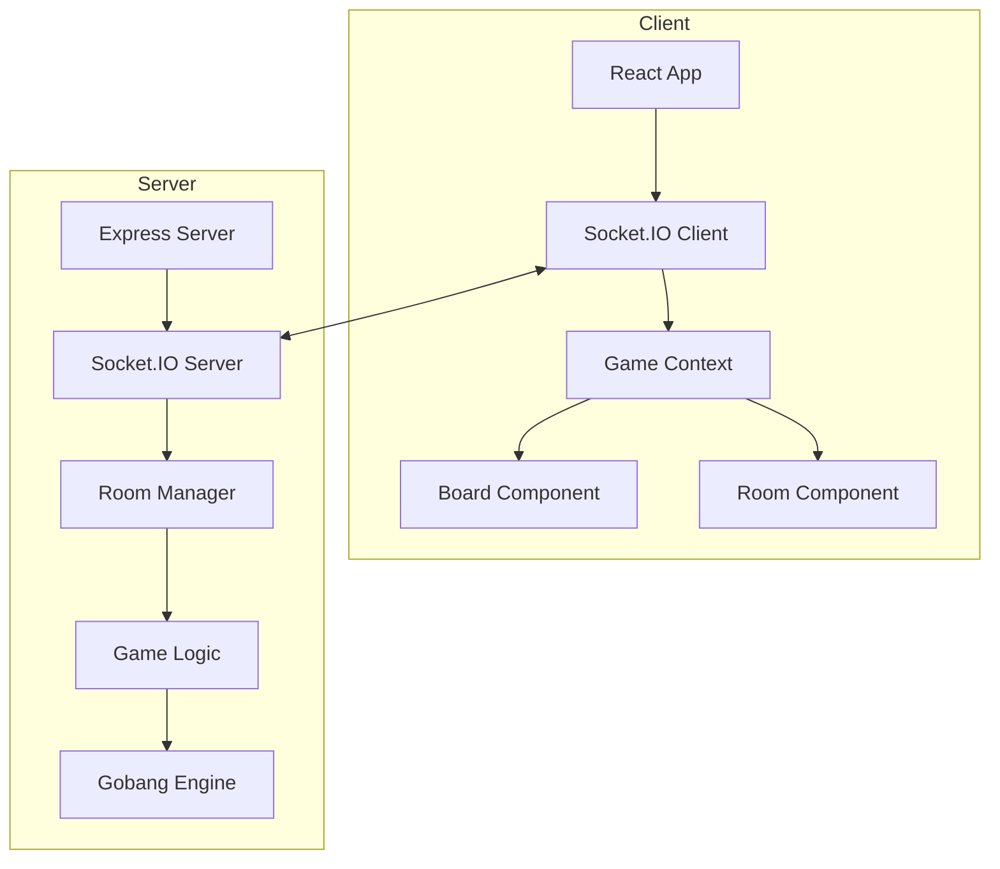

# 五子棋 (Gobang) 技术设计文档

## 1. 概述

### 1.1 项目信息
- **项目名称**: gobang
- **游戏类型**: 双人对弈策略游戏
- **技术栈**: React (前端) + Node.js/Express + Socket.IO (后端)
- **部署方式**: Docker 容器化部署

### 1.2 游戏规则
- 棋盘：15x15 网格
- 黑棋先行，每人每回合在空白交叉点放置棋子
- 横、竖、斜任一方向连续五子获胜
- 棋盘填满无胜者则平局

## 2. 系统架构



## 3. 目录结构

```
server/games/gobang/
├── index.js              # 游戏入口，路由注册
├── GameRoom.js           # 房间类，管理游戏状态
├── GobangEngine.js       # 游戏引擎，核心算法
└── constants.js          # 常量定义

client/src/games/gobang/
├── index.jsx             # 游戏页面入口
├── components/
│   ├── Board.jsx         # 棋盘组件
│   ├── Cell.jsx          # 单个交叉点组件
│   ├── PlayerInfo.jsx    # 玩家信息显示
│   └── GameResult.jsx     # 游戏结果弹窗
├── hooks/
│   └── useGobangGame.js  # 游戏状态管理 Hook
└── styles/
    └── gobang.css        # 游戏样式
```

## 4. 数据模型

### 4.1 房间状态 (RoomState)
```typescript
interface RoomState {
  roomId: string;              // 4-6位房间号
  status: 'waiting' | 'playing' | 'ended';
  players: [Player, Player];   // 固定2人
  currentTurn: 0 | 1;          // 0: 黑棋, 1: 白棋
  board: number[][];            // 15x15, 0=空, 1=黑, 2=白
  winner: 0 | 1 | 2 | null;     // 0=黑胜, 1=白胜, 2=平局, null=未结束
  moveCount: number;           // 已下棋数
  lastMove: {x: number, y: number} | null;  // 最后落子位置
}

interface Player {
  id: string;                   // 玩家唯一标识
  socketId: string;             // WebSocket ID
  role: 'black' | 'white';      // 棋子颜色
  status: 'online' | 'offline'; // 在线状态
}
```

## 5. 核心算法

### 5.1 获胜判断算法
```javascript
// 检查四个方向的连子数
const directions = [
  [1, 0],   // 水平
  [0, 1],   // 垂直
  [1, 1],   // 主对角线
  [1, -1]   // 副对角线
];

// 从落子点向两个方向延伸，统计连子数
function checkWin(board, x, y, player) {
  const stone = player === 0 ? 1 : 2;
  
  for (const [dx, dy] of directions) {
    let count = 1;
    // 正方向
    for (let i = 1; i < 5; i++) {
      const nx = x + dx * i;
      const ny = y + dy * i;
      if (board[ny]?.[nx] === stone) count++;
      else break;
    }
    // 反方向
    for (let i = 1; i < 5; i++) {
      const nx = x - dx * i;
      const ny = y - dy * i;
      if (board[ny]?.[nx] === stone) count++;
      else break;
    }
    if (count >= 5) return true;
  }
  return false;
}
```

### 5.2 房间号生成
```javascript
// 生成4位数字房间号
function generateRoomId() {
  return Math.floor(1000 + Math.random() * 9000).toString();
}
```

## 6. Socket.IO 事件定义

### 6.1 事件列表

| 事件名 | 方向 | 载荷 | 说明 |
|--------|------|------|------|
| gobang:create-room | C→S | {} | 创建房间 |
| gobang:room-created | S→C | { roomId, role } | 房间创建成功 |
| gobang:join-room | C→S | { roomId } | 加入房间 |
| gobang:room-joined | S→C | { room, role } | 加入成功 |
| gobang:game-start | S→C | { board, currentTurn } | 游戏开始 |
| gobang:make-move | C→S | { x, y } | 落子 |
| gobang:move-made | S→C | { x, y, player, board, currentTurn } | 落子通知 |
| gobang:game-over | S→C | { winner, reason } | 游戏结束 |
| gobang:leave-room | C→S | {} | 离开房间 |
| gobang:player-disconnected | S→C | { playerIndex } | 玩家断线 |
| gobang:error | S→C | { message } | 错误通知 |

### 6.2 游戏流程状态机
```
WAITING → (2人加入) → PLAYING → (有人获胜/平局) → ENDED
   ↑                        │
   └────── (再来一局) ──────┘
```

## 7. 前端组件设计

### 7.1 Board 组件
- **职责**: 渲染15x15棋盘，处理点击事件
- **状态**: 当前棋盘数据，当前回合，是否轮到自己
- **事件**: onCellClick(x, y)

### 7.2 Cell 组件
- **职责**: 渲染单个交叉点
- **状态**: 位置坐标，棋子颜色，最后落子高亮
- **样式**: 交叉点hover效果，棋子放置动画

### 7.3 PlayerInfo 组件
- **职责**: 显示玩家信息
- **状态**: 颜色，在线状态，当前回合标识

### 7.4 GameResult 组件
- **职责**: 显示游戏结果
- **状态**: 胜者，平局原因
- **操作**: 再来一局，返回大厅

## 8. 错误处理

| 错误场景 | 错误码 | 处理方式 |
|----------|--------|----------|
| 房间不存在 | ROOM_NOT_FOUND | 提示用户并返回大厅 |
| 房间已满 | ROOM_FULL | 提示"房间已满" |
| 非本人回合 | NOT_YOUR_TURN | 忽略操作 |
| 位置已有棋子 | CELL_OCCUPIED | 忽略操作 |
| 玩家断线 | PLAYER_DISCONNECTED | 通知对方，等待重连 |

## 9. Docker 配置

### 9.1 前端 (Nginx)
```nginx
server {
    listen 80;
    location / {
        root /usr/share/nginx/html;
        try_files $uri $uri/ /index.html;
    }
    location /api {
        proxy_pass http://server:3001;
    }
    location /socket.io {
        proxy_pass http://server:3001;
        proxy_http_version 1.1;
        proxy_set_header Upgrade $http_upgrade;
        proxy_set_header Connection "upgrade";
    }
}
```

## 10. 正确性验证

### 10.1 游戏状态不变式
1. 任意时刻 board[x][y] 的值只能是 0, 1, 2
2. currentTurn 只能在 0 和 1 之间切换
3. 当 moveCount > 0 时，currentTurn = (moveCount - 1) % 2
4. winner 为 null 时 status 必须为 playing 或 waiting

### 10.2 边界测试用例
1. 首次落子在中心点 (7,7)
2. 边界点落子 (0,0)
3. 最后一子定胜负
4. 长连（6子以上）只计5子
5. 平局（棋盘填满）
