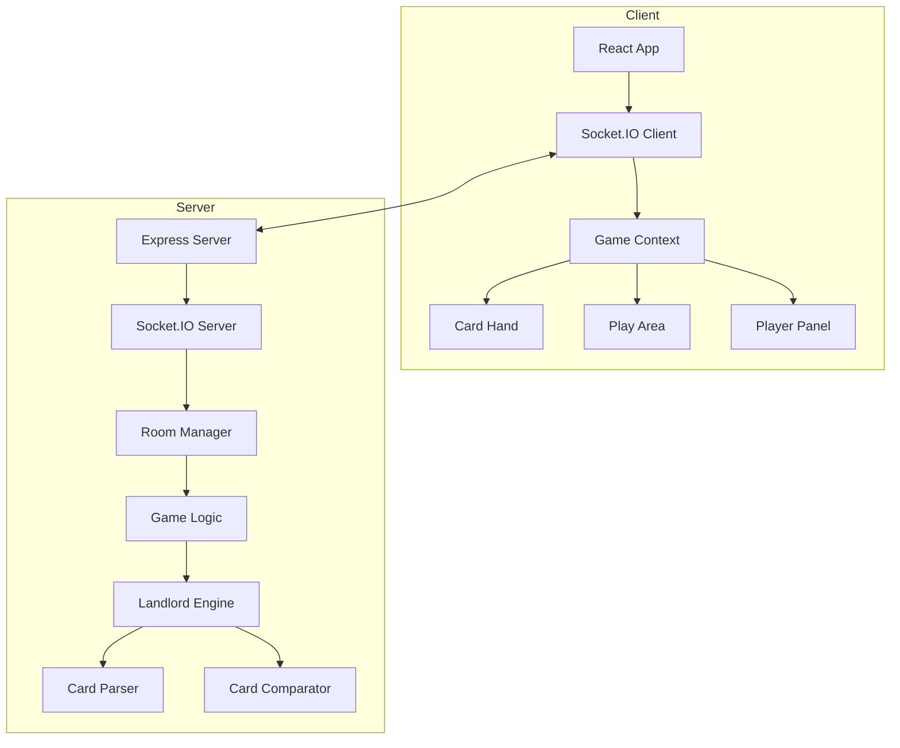

# 斗地主 (Landlord) 技术设计文档

## 1. 概述

### 1.1 项目信息
- **项目名称**: landlord
- **游戏类型**: 三人对战牌类游戏
- **技术栈**: React (前端) + Node.js/Express + Socket.IO (后端)
- **部署方式**: Docker 容器化部署

### 1.2 游戏规则
- 三名玩家，使用54张牌
- 叫地主确定身份（1-3分）
- 地主20张手牌，农民17张
- 地主vs农民，非对称对抗

## 2. 系统架构



## 3. 目录结构

```
server/games/landlord/
├── index.js              # 游戏入口
├── GameRoom.js           # 房间管理
├── LandlordEngine.js     # 游戏引擎
├── CardParser.js         # 牌型解析
├── CardComparator.js     # 牌型比较
├── constants.js          # 常量定义
└── AIAgent.js            # AI托管（可选）

client/src/games/landlord/
├── index.jsx             # 游戏页面入口
├── components/
│   ├── CardHand.jsx      # 手牌组件
│   ├── Card.jsx          # 单张牌组件
│   ├── PlayArea.jsx      # 出牌区域
│   ├── PlayerPanel.jsx   # 玩家信息面板
│   ├── BottomCards.jsx   # 底牌显示
│   ├── BidPanel.jsx      # 叫分面板
│   └── GameResult.jsx    # 结果弹窗
├── hooks/
│   └── useLandlordGame.js # 游戏状态管理
└── styles/
    └── landlord.css      # 游戏样式
```

## 4. 数据模型

### 4.1 房间状态 (RoomState)
```typescript
interface RoomState {
  roomId: string;                    // 4-6位房间号
  status: 'waiting' | 'dealing' | 'calling' | 'playing' | 'ended';
  players: [Player, Player, Player];  // 固定3人
  landlordIndex: number | null;       // 地主索引 (0,1,2)
  
  // 叫牌阶段
  currentCaller: number;              // 当前叫牌玩家
  highestBid: number;                 // 最高叫分 (0=不叫,1,2,3)
  highestBidder: number;              // 最高叫分者索引
  
  // 出牌阶段
  currentPlayer: number;              // 当前出牌玩家
  lastPlayedCards: PlayedCards | null; // 上家出的牌
  passCount: number;                  // 连续跳过人数
  
  // 牌数据
  hands: [string[], string[], string[]]; // 三人手牌
  bottomCards: string[];               // 底牌3张
  
  winner: 'landlord' | 'farmer' | null;
}

interface Player {
  id: string;
  socketId: string;
  position: number;      // 0,1,2
  status: 'online' | 'offline';
}

interface PlayedCards {
  player: number;        // 出牌玩家索引
  cards: string[];       // 出的牌
  cardType: CardType;    // 牌型
  rank: number;           // 牌型等级（用于比较大小）
}
```

### 4.2 牌型定义
```typescript
interface CardTypeInfo {
  type: CardType;
  name: string;
  minLength: number;
  rank: number;  // 牌型等级，炸弹和王炸特殊处理
}

// 牌面值定义
const CARD_VALUES = {
  '3': 1, '4': 2, '5': 3, '6': 4, '7': 5, '8': 6,
  '9': 7, '10': 8, 'J': 9, 'Q': 10, 'K': 11, 'A': 12,
  '2': 13, 'small_joker': 14, 'big_joker': 15
};
```

## 5. 核心算法

### 5.1 发牌算法
```javascript
function shuffleAndDeal() {
  const deck = createDeck();  // ['3s', '3h', '3d', '3c', ...]
  shuffle(deck);              // Fisher-Yates 洗牌
  
  const hands = [
    deck.slice(0, 17),
    deck.slice(17, 34),
    deck.slice(34, 51)
  ];
  const bottomCards = deck.slice(51);
  
  return { hands, bottomCards };
}
```

### 5.2 牌型解析
```javascript
function parseCards(cards) {
  // 按点数分组
  const groups = {};
  cards.forEach(card => {
    const value = getCardValue(card);
    groups[value] = groups[value] || [];
    groups[value].push(card);
  });
  
  const counts = Object.values(groups).map(g => g.length).sort((a,b) => b-a);
  
  // 判断牌型
  if (isJokerBomb(cards)) return { type: 'joker-bomb', rank: 100 };
  if (isBomb(groups, counts)) return { type: 'bomb', rank: 50 + baseValue };
  if (isPlane(groups, counts)) return { type: 'plane', rank: ... };
  // ... 其他牌型判断
}
```

### 5.3 牌型比较
```javascript
function canBeat(playedCards, upperCards) {
  if (!upperCards) return true;  // 首次出牌
  if (upperCards.type === 'joker-bomb') return false;
  if (playedCards.type === 'joker-bomb') return true;
  if (playedCards.type === 'bomb' && upperCards.type !== 'bomb') return true;
  
  return playedCards.type === upperCards.type && 
         playedCards.rank > upperCards.rank &&
         playedCards.cards.length === upperCards.cards.length;
}
```

### 5.4 叫地主流程
```javascript
function processBid(playerIndex, bid) {
  if (bid > highestBid) {
    highestBid = bid;
    highestBidder = playerIndex;
  }
  
  if (bid === 3) {
    // 叫到3分立即确定地主
    selectLandlord(highestBidder);
  } else if (allPlayersHaveCalled()) {
    // 所有人都叫过，确定地主
    selectLandlord(highestBidder);
  } else {
    // 下一个叫牌
    currentCaller = (currentCaller + 1) % 3;
  }
}
```

### 5.5 出牌验证
```javascript
function validatePlay(cards, hand) {
  // 1. 检查是否有这些牌
  const handSet = new Set(hand);
  for (const card of cards) {
    if (!handSet.has(card)) return false;
  }
  
  // 2. 解析牌型
  const parsed = parseCards(cards);
  if (!parsed) return false;
  
  // 3. 如果不是首次出牌，检查是否大于上家
  if (lastPlayedCards && !canBeat(parsed, lastPlayedCards)) {
    return false;
  }
  
  return true;
}
```

## 6. Socket.IO 事件

### 6.1 事件列表

| 事件名 | 方向 | 载荷 | 说明 |
|--------|------|------|------|
| landlord:create-room | C→S | {} | 创建房间 |
| landlord:room-created | S→C | { roomId, position } | 创建成功 |
| landlord:join-room | C→S | { roomId } | 加入房间 |
| landlord:room-joined | S→C | { room, position } | 加入成功 |
| landlord:player-joined | S→C | { position } | 其他玩家加入 |
| landlord:game-start | S→C | {} | 游戏开始 |
| landlord:cards-dealt | S→C | { handCards } | 发牌完成 |
| landlord:call-turn | S→C | { currentCaller, canBid } | 轮到叫地主 |
| landlord:call-made | S→C | { player, bid } | 叫分结果 |
| landlord:landlord-selected | S→C | { landlordIndex, bottomCards } | 地主确定 |
| landlord:play-turn | S→C | { currentPlayer } | 轮到出牌 |
| landlord:cards-played | S→C | { player, cards } | 出牌结果 |
| landlord:pass-made | S→C | { player } | 不出 |
| landlord:game-over | S→C | { winner, reason } | 游戏结束 |
| landlord:error | S→C | { message } | 错误 |

### 6.2 游戏状态机
```
WAITING → (3人加入) → DEALING → CALLING → PLAYING → ENDED
                                              ↓
                                         (再来一局)
                                              ↓
                                           WAITING
```

## 7. 前端组件

### 7.1 Card 组件
- 显示单张扑克牌
- 状态：正面/背面、选中、高亮
- 支持点击选中

### 7.2 CardHand 组件
- 渲染玩家手牌
- 自动排列（3带1、顺子等提示）
- 选中状态管理
- 排序功能（按点数/花色）

### 7.3 PlayArea 组件
- 显示当前打出的牌
- 显示上家出的牌
- 出牌/不出按钮

### 7.4 PlayerPanel 组件
- 显示玩家头像/名称
- 手牌数量
- 地主标识
- 在线状态

### 7.5 BidPanel 组件
- 叫分按钮（1分、2分、3分、不叫）
- 当前最高分显示
- 倒计时（可选）

## 8. 错误处理

| 错误场景 | 处理 |
|----------|------|
| 房间不存在 | 提示并返回大厅 |
| 房间已满 | 提示"房间已满" |
| 非本人回合出牌 | 忽略，显示提示 |
| 出牌不符合规则 | 提示错误原因 |
| 玩家断线 | 通知其他玩家，等待重连 |
| 超时不出 | 自动跳过或托管 |

## 9. Docker 配置

### 9.1 前端 (Nginx)
```nginx
server {
    listen 80;
    location / {
        root /usr/share/nginx/html;
        try_files $uri $uri/ /index.html;
    }
    location /api {
        proxy_pass http://server:3001;
    }
    location /socket.io {
        proxy_pass http://server:3001;
        proxy_http_version 1.1;
        proxy_set_header Upgrade $http_upgrade;
        proxy_set_header Connection "upgrade";
    }
}
```

## 10. 正确性验证

### 10.1 游戏状态不变式
1. 三人手牌总数 = 54 - 3 = 51张
2. 地主手牌 = 20张，农民手牌 = 17张
3. 叫分过程中 highestBid 单调递增
4. 出牌阶段 currentPlayer 逆时针轮转
5. 任意时刻每张牌只出现在一个人的手牌中

### 10.2 边界测试
1. 无人叫地主 → 重新发牌
2. 地主首局获胜
3. 农民获胜（任意农民先出完）
4. 炸弹/王炸改变局势
5. 春天（农民打地主一张牌都没出）
